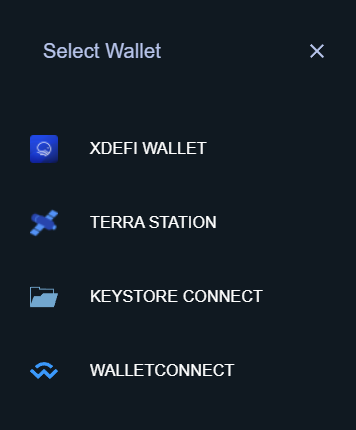
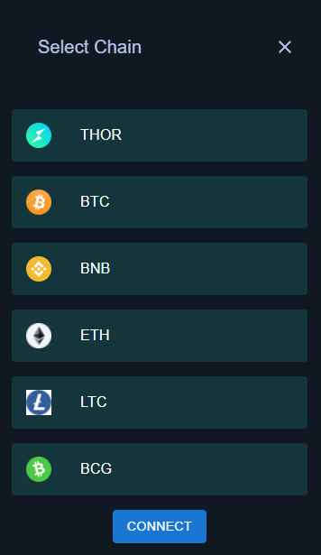

# Lendscape wallet provider

## Development Stack
- React

We have intergrated [Xdefi wallet](https://chrome.google.com/webstore/detail/xdefi-wallet/hmeobnfnfcmdkdcmlblgagmfpfboieaf?hl=en) and [Terra wallet](https://chrome.google.com/webstore/detail/terra-station-wallet/aiifbnbfobpmeekipheeijimdpnlpgpp/related), [Walletconnect](https://chrome-stats.com/d/djmlnjfkgolclllleomgpgodjkmnjoec), [Keystore Connect](https://www.file-extension.info/format/keystore#:~:text=KEYSTORE%20is%20a%20file%20extension,programs%20distributed%20for%20Windows%20platform.) for Thorchain connection.
We have used :<br />
    -for Xdefi wallet, xdefi wallect connect sdk(especially it is possible to connect to multichains)
    -for Terra wallet, [@terra-money/wallet-provider](https://www.npmjs.com/package/@terra-money/wallet-provider)
    -for Walletconnect, [@web3-react/walletconnect-connector](npmjs.com/package/@web3-react/walletconnect-connector)
    -for keystore, [xchainjs library](https://github.com/xchainjs/xchainjs-lib)

</img>
</img>
## Prerequisites
- Node.js/NPM - You can use [NVM](https://github.com/nvm-sh/nvm) / [NVM for Windows](https://github.com/coreybutler/nvm-windows) to manage Node version installs (minimum `16.13.0`).
- Yarn (optional)

## How to use
1. `npm i` or `yarn` 
1. `npm start` to start a localhost development server at [http://localhost:8080](http://localhost:3000) or `npm run build` to build and compile development version


<details>
<summary>Click to expand code example</summary>
<br />

**components/keystore.js**

```javascript
//keystore wallet create
const GenerateKeystore = async () => {
    const phrase = generatePhrase() 
    console.log(`phrase ${phrase}`)
    const isCorrect = validatePhrase(phrase)
    console.log(`Phrase valid?: ${isCorrect}`)
    const keystore = await encryptToKeyStore(phrase, password)
    console.log(keystore, "keystore")
    const jsonString = `data:text/json;chatset=utf-8,${encodeURIComponent(
        JSON.stringify(keystore)
        )}`;
    const link = document.createElement("a");
    link.href = jsonString;
    link.download = "keystore.txt";
    link.click();
}
```

**pages/Xdefi.js**

```javascript
//xdefi wallect connect function
const request = (object, method, params) => {
    console.debug({ object, method, params });
    try {
        object.request(
            {
                method,
                params: params,
            },
            (error, result) => {
                // request result handling
                console.debug("callback", error, result);
                this.lastResult = { error, result };
            }
        );
    } catch (e) {
        console.error(e);
        this.lastResult = `Error: ${e.message}`;
    }
}


```

</details>
